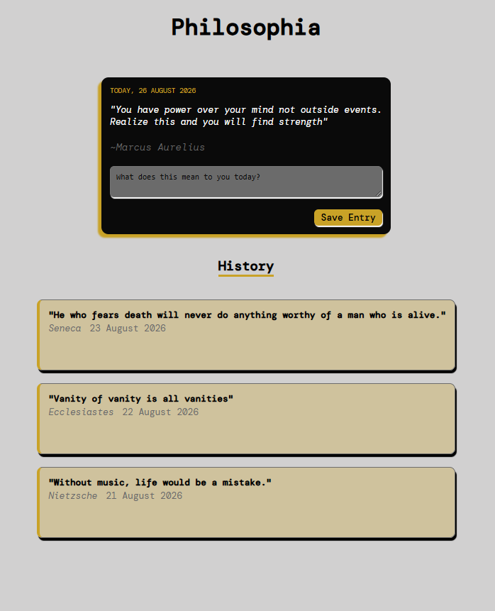

# Philosophia

A daily reflection app. Each day shows a philosopher's quote — you write a short journal entry responding to it, and it saves to a growing history you can revisit and edit.

Built as a portfolio project to practice core JavaScript (DOM manipulation, localStorage, array/object handling) before moving on to React.

## Features

- Displays one quote per day, deterministically (same quote all day, changes the next)
- Write and save a reflection tied to that day's quote
- Browse past entries in a history list, newest first
- Click into any past entry to expand and edit it
- All data persists locally in the browser — no backend, no account needed

## Tech stack

- HTML / CSS
- Vanilla JavaScript
- Browser `localStorage` for persistence

## Getting started

No build tools or dependencies — just open `index.html` in a browser.

```bash
git clone https://github.com/EC-Prime/Philosophia.git
cd Philosophia
open index.html
```

## Project structure

```
stoic-journal/
├── index.html      # page structure
├── style.css        # black / white / gold styling
├── quotes.js         # static pool of quotes
└── app.js            # app logic (today's quote, save, render, edit)
```


## Screenshot

<p align="center">
  
</p>

## Status
🚧 In progress — built milestone by milestone. See commit history for build order.
